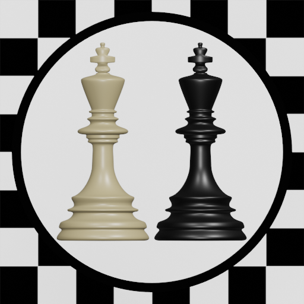
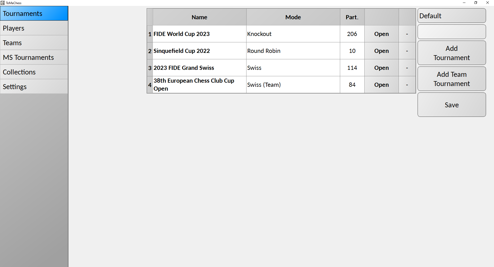
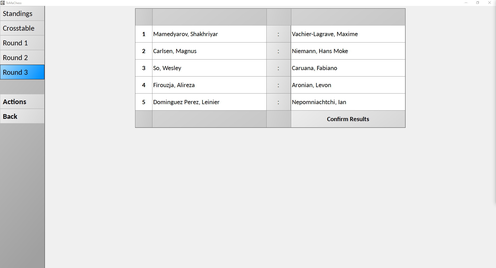
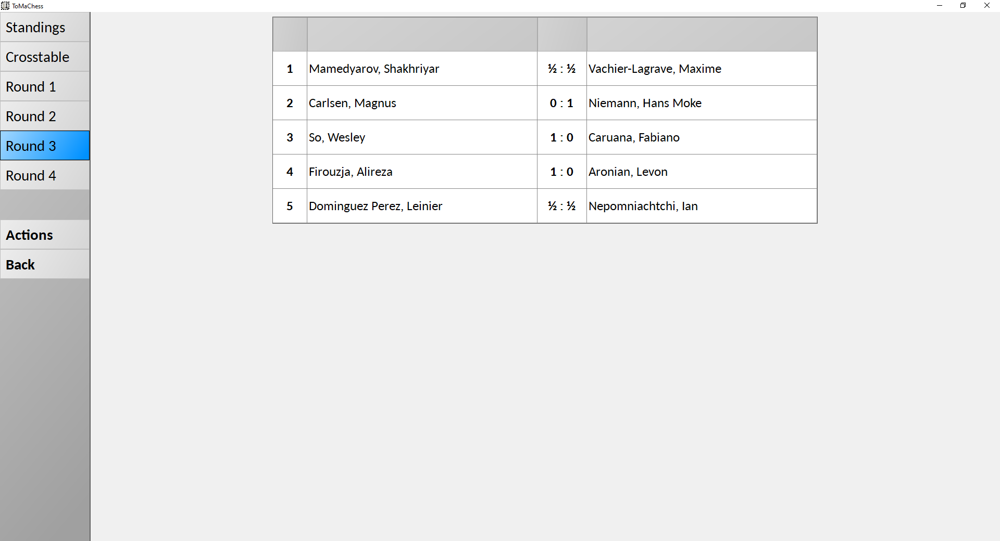
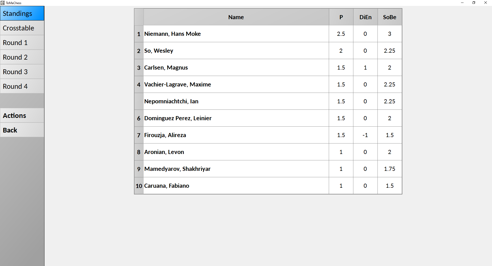
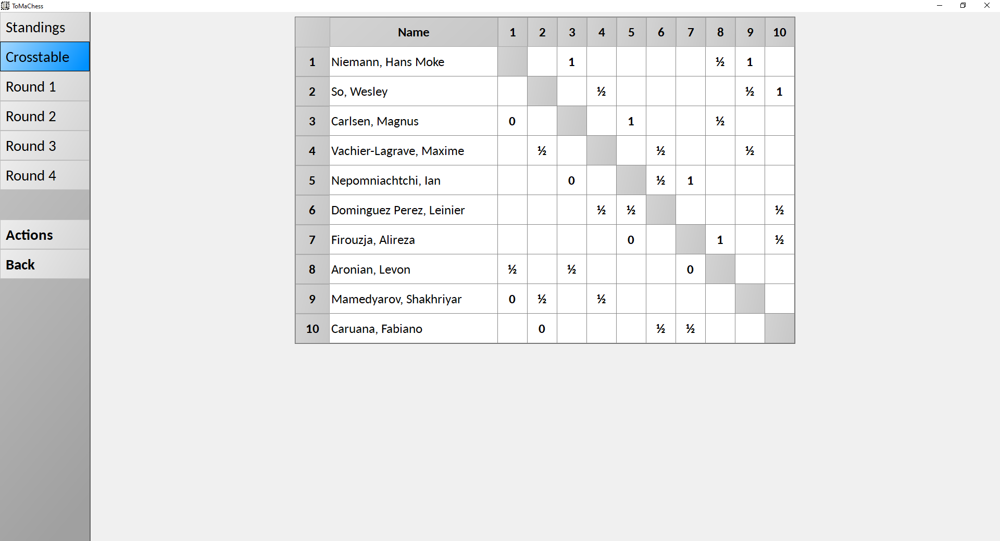
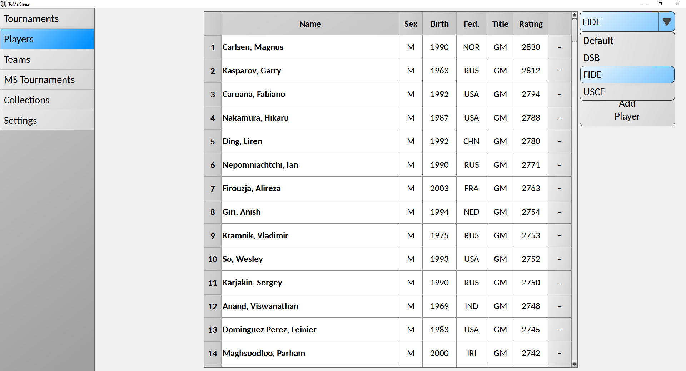
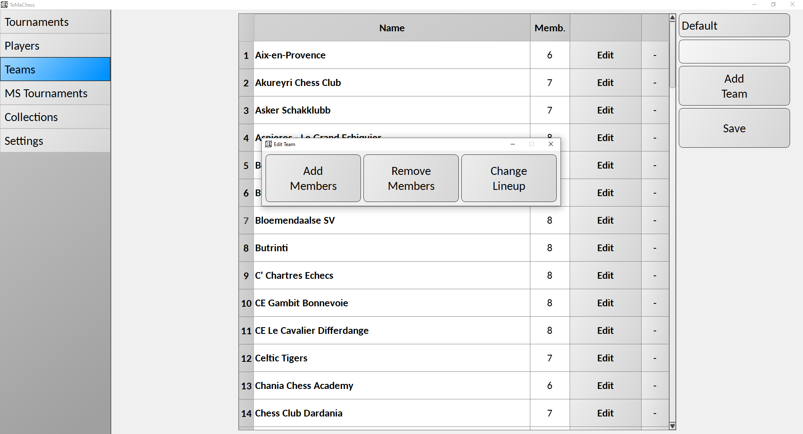
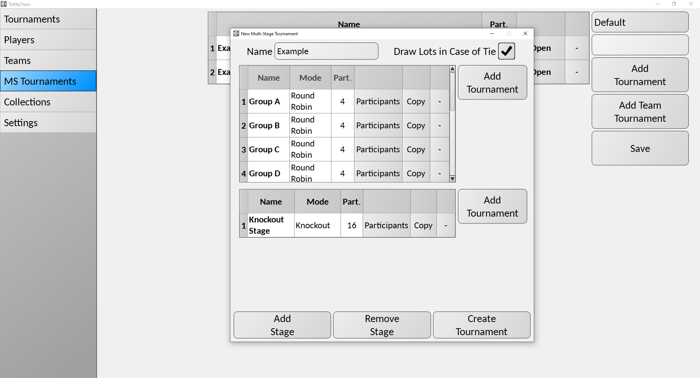

# ToMaChess  
  
*ToMaChess* is a gui application to manage chess tournaments written in Python.  
  
The most recent release can be downloaded at [Releases](https://github.com/Moritz72/ToMaChess/releases).  
  
## Tournaments  
There are currently six tournament modes available: *Swiss*, *Round Robin*, *Knockout*, *Keizer*, *Scheveningen* and *Custom*.  
  
  
  
*Swiss* uses the Dutch System implementation from [bbpPairings](https://github.com/BieremaBoyzProgramming/bbpPairings) to pair the rounds.  
Parameters: *Rounds*, *Pairings (First Round)*, *Top Seed (First Round)*, *Point System*, *Half-Point Bye*, *Baku Acceleration* and *Tiebreak (1) - (4)*.  
  
*Round Robin* pairs the rounds by the Circle or Berger method.  
Parameters: *Cycles*, *Pairing Method*, *Custom Seeding*, *Point System* and *Tiebreak (1) - (4)*.  
  
*Knockout* (Single-elimination) pairs rounds by the specified pairing method but, in successive rounds, only pairs the winners of the previous round. Furthermore, if there is a tie after the number of games specified, the specified number of tiebreak games will be played until either the tie is resolved or the number of tiebreaks specified in the Armageddon parameter is reached.  
Parameters: *Games per Match*, *Games per Tiebreak*, *Pairing Method* and *Armageddon*.  
  
*Keizer* pairs rounds according to the [Keizer system](https://jbfsoftware.com/wordpress/sevilla-keizer) or at least according to the information I was able to find on how it is supposed to work.  
Parameters: *Rounds*, *Ratio (First to Last)*, *Score for Byes (%)*, *No Pairing Repeats*, *Points System* and *Tiebreak (1) - (2)*.  
  
*Scheveningen* pairs rounds according to the [Scheveningen system](https://en.wikipedia.org/wiki/Scheveningen_system). More specifically the exact pairing system is inspired by the one developed by Richard Furness as described in [this document](https://www.englishchess.org.uk/wp-content/uploads/2010/04/roundRobinPairings.pdf).  
Parameters: *Cycles*, *Point System* and *Tiebreak (1) - (2)*.  
  
*Custom* does not pair by itself at all, instead the user can manually pair all games of all rounds.  
Parameters: *Games per Round*, *Rounds*, *Point System*, *Half-Point Bye* and *Tiebreak (1) - (4)*.  
  

  
### Tiebreak Criteria  
The available tiebreak criteria are  
- *Buchholz* (with additional parameters *Cut (bottom)*, *Cut (top)* and *Virtual Opponents*)  
- *Buchholz Sum* (with additional parameters *Cut (bottom)*, *Cut (top)* and *Virtual Opponents*)  
- *Sonneborn-Berger* (with additional parameters *Cut (bottom)*, *Cut (top)* and *Virtual Opponents*)  
- *Games*  
- *Games as Black*  
- *Wins* (with additional parameter *Include Forfeits*)  
- *Wins as Black*  (with additional parameter *Include Forfeits*)  
- *Average Rating* (with additional parameters *Cut (bottom)*, *Cut (top)* and *Include Forfeits*)  
- *Progressive Scores* (with additional parameters *Cut (bottom)* and *Cut (top)*)  
- *Koya System* (with additional parameter *Threshold (%)*)  
- *Direct Encounter*  
  
### Armageddon  
For the *Armageddon* parameter the user can specify additional parameters *With Armageddon*, *After Tiebreak* and *Color Determination* (In Order, Random or Choice).  
  
## Players  
Players can be manually added. Additionally, one can use various rating lists (FIDE, DSB (Germany), USCF (USA), ECF (England), ÖSB (Austria)) after downloading them through the rating lists window in the settings.  
  
  
  
## Teams  
Teams are ordered sets of players. One can add players to a team, remove players from a team and change the lineup.  
  
  
  
### Team Tournaments  
Team tournaments work much like regular tournaments, except for some restrictions and changes e.g. for tiebreaks or Armageddon.  
  
There is an additional parameter *Boards* which specifies on how many boards the matches are played and there are two tiebreak criteria exclusive to team tournaments: *Board Points* and *Berliner Wertung*.  
  
## Multi-Stage Tournaments  
It is also possible to combine multiple tournaments to a multi-stage tournament.  
  
A multi-stage tournament consists of a first stage with a number of tournaments where the participants are predetermined. On top of that, it has an arbitrary number of further stages where the participants of the stage tournaments are the participants that got a certain placement in  a certain tournament of the previous stage.  
  
  
  
For example one could have *Round Robin* tournaments *Group A* up to *Group H* with four players each in the first stage and then in the second stage a *Knockout* tournament *Finals* with all participants who placed first or second in their respective group.  
  
If the option *Draw Lots in Case of Tie* is disabled, it is also possible to create a regular tournament with play-offs in case of a tie for first place. This can be achieved by creating a multi-stage tournament with only the desired regular tournament as the first stage and a *Knockout* tournament with only the first place as a participant as a second stage.  
  
## Exporting
Tournament standings, pairings and results can be automtically exported as pdf files by specifying *PDF Output Path* in the settings.  
  
Similarly, one can configure *Server Address*, *Server Username* and *Server Password* to automatically export tournament data in form of html files to an FTP-server.  
  
## Settings  
- *Language* (English, German or Japanese)  
- *Style* (Light or Dark)  
- *Font*  
- *Font Size*  
- *bbpPairings Path*  
- *PDF Output Path*  
- *Server Address*  
- *Server Username*  
- *Server Password*  
  
## License  
This project is licensed under the [GPLv3](https://www.gnu.org/licenses/gpl-3.0.html).  
